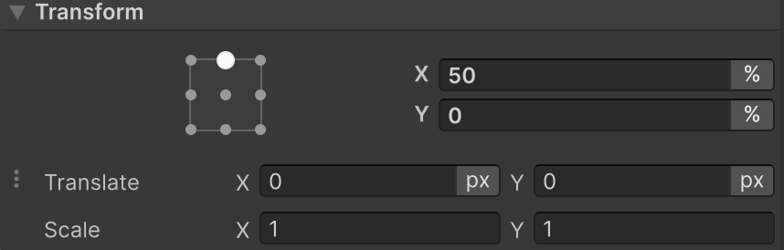

+++
date = '2024-11-03T15:09:15+07:00'
draft = false
title = 'Between The Lines: Vertex Animations'
hideSummary = true
[cover]
image = "0.png"
alt = "The alt text"
caption = ""
relative = false
tags = ['Unity', 'UI Toolkit', 'UI']
categories = ["GameDev"]
+++

## Chapter 1: Animation concept

Let's start by explaining how animation will work for our UI elements.

We are not talking here about transitions/delays and other built-in animation features in UI Toolkit.

From previous articles, we have already learnt how to create customisable UI elements. Now it's time to add some dynamism.

It is worth noting that animation generation is quite resource-intensive compared to other operations, as it will load the CPU on almost every frame.

If we decompose the animation into basic components, it would be the change of state of the object (size, shape, colour, position, etc.).

The first task we face is to learn how to call the internal methods of the **VisualElement** class at a certain interval.

For this purpose, we will use the internal implementation of the **IVisualElementScheduler** interface.

From the name you can guess that it deals with planning and execution of some actions, let's understand how to work with it.
```csharp
public RombElement()
{
    schedule.execute(MethodName);
}
```

In this code sample, when creating an element, we call the **Execute** method by passing **Action** to it.

This means that this method will be called immediately after the constructor is executed.

It is worth understanding that it will be executed only once, but how do we make multiple calls?

-- I'm glad you asked, I'll answer

```csharp
public RombElement()
{
    schedule.Execute(MethodName).Every(16);
}
```

We add **.Every()** to our call, which means our method will be called every X milliseconds.

The base is done, let's make it more complicated.

## Chapter 2: Color animation

By colour animation we will mean the change of colour/transparency and its related components in **UI Element**.

Let's make our element appear from transparency.

As always, I'll give you all the code, and then I'll parse it in detail.

```csharp
using UnityEngine;
using UnityEngine.UIElements;

namespace CustomElements
{
    [UxmlElement]
    public partial class RombElement : VisualElement
    {
        private float _timeLeft;
        
        private const float AlphaValue = 255;
        
        [UxmlAttribute] public float AnimationTime = 3f;

        public RombElement()
        {
            generateVisualContent += GenerateVisualContent;

            _timeLeft = AnimationTime;
            schedule.Execute(ChangeColorAnimation).Every(16);
        }

        private void ChangeColorAnimation()
        {
            _timeLeft -= Time.deltaTime;
            
            firstColor.a = (byte)Mathf.Lerp(firstColor.a, AlphaValue, Time.fixedDeltaTime / _timeLeft);
            secondColor.a = (byte)Mathf.Lerp(secondColor.a, AlphaValue, Time.deltaTime / _timeLeft);
            thirdColor.a = (byte)Mathf.Lerp(thirdColor.a, AlphaValue, Time.fixedDeltaTime / _timeLeft);
            fourColor.a = (byte)Mathf.Lerp(fourColor.a, AlphaValue, Time.deltaTime / _timeLeft);

            MarkDirtyRepaint();
        }

        Vertex[] vertices = new Vertex[4];
        ushort[] indices = { 0, 1, 2, 2, 3, 0 };

        private Color32 firstColor  = new (255, 0, 0, 0);
        private Color32 secondColor  = new (0, 255, 0, 0);
        private Color32 thirdColor  = new (0, 0, 255, 0);
        private Color32 fourColor  = new (17, 55, 55, 0);

        void GenerateVisualContent(MeshGenerationContext mgc)
        {
            vertices[0].tint = firstColor;
            vertices[1].tint = secondColor;
            vertices[2].tint = thirdColor;
            vertices[3].tint = fourColor;

            var top = 0;
            var left = 0f;
            var middleX = contentRect.width / 2;
            var middleY = contentRect.height / 2;
            var right = contentRect.width;
            var bottom = contentRect.height;

            vertices[0].position = new Vector3(left, middleY, Vertex.nearZ);
            vertices[1].position = new Vector3(middleX, top, Vertex.nearZ);
            vertices[2].position = new Vector3(right, middleY, Vertex.nearZ);
            vertices[3].position = new Vector3(middleX, bottom, Vertex.nearZ);

            MeshWriteData mwd = mgc.Allocate(vertices.Length, indices.Length);
            mwd.SetAllVertices(vertices);
            mwd.SetAllIndices(indices);
        }
    }
}
```

Let's turn our attention to the class constructor, we can notice the **scheduler** method call there.

We want to call the **ChangeColorAnimation** method every 16 ms.

Next comes the body of the animation method itself, in it we can notice **_timeLeft**, this is a variable to keep track of the animation time, which is initially equal to **AnimationTime**.

By the way, it can be configured directly through **UI Builder**, thanks to the new attribute **[UxmlAttribute]**.

We digress a little, let's back to our animations.

```csharp
private void ChangeColorAnimation()
{
    _timeLeft -= Time.deltaTime;
    
    firstColor.a = (byte)Mathf.Lerp(firstColor.a, AlphaValue, Time.fixedDeltaTime / _timeLeft);
    secondColor.a = (byte)Mathf.Lerp(secondColor.a, AlphaValue, Time.deltaTime / _timeLeft);
    thirdColor.a = (byte)Mathf.Lerp(thirdColor.a, AlphaValue, Time.fixedDeltaTime / _timeLeft);
    fourColor.a = (byte)Mathf.Lerp(fourColor.a, AlphaValue, Time.deltaTime / _timeLeft);

    MarkDirtyRepaint();
}
```

Next, we have four lines where we describe that the shades of our vertices should tend from 0 to 255.

After that, we call the **MarkDirtyRepaint()** method to trigger the **GenerateVisualContent(...)** method.



## Chapter 3: New Horizons
Let's face it, colour animation is the easiest thing to come up with.

But what if we have a request for immediacy? For example, we want to animate icons/sprites.
Sometimes interesting things come to mind, like thoughts or heavier things like animating icons without frame animation.

In that case consider the following example, let's say we want to have an animation for a bell.


Conceptually, we don't do anything complicated, we just change the **rotate** value of **VisualElement** and change the centre of mass.

Why change the centre of the element? To make it logically easier to work with and animate.

To do this we need to change the **transform-Origin** property, which takes two values (X, Y), we will do it directly in the class constructor.



Normally an element's **transform-Origin** is **center-center**, that is (X = 50%, Y = 50%), and we want it to be **top-center** (X = 0, Y = 50%).

You can see more details in [documentation](https://docs.unity3d.com/Manual/UIE-Transform.html)

Let's code it!

```csharp
using UnityEngine.UIElements;

namespace CustomElements
{
    [UxmlElement]
    public partial class ImageAnimation : VisualElement
    {
        [UxmlAttribute] private float AngleLimit = 25;
        [UxmlAttribute] private bool AnimationIsStopped = true;
        
        private bool _rotationDirectionIsMinus = true;
        
        public ImageAnimation()
        {
            style.transformOrigin = new TransformOrigin( Length.Percent(50), 0);
            schedule.Execute(PlayAnimation).Every(16);
        }

        private void PlayAnimation()
        {
            if (AnimationIsStopped)
                return;
            
            RotateBell();
            MarkDirtyRepaint();
        }

        void RotateBell()
        {
            var newRotate = style.rotate;
            Angle rotateAngle = newRotate.value.angle;

            if (_rotationDirectionIsMinus)
            {
                rotateAngle.value--;
                if (rotateAngle.value < -AngleLimit)
                {
                    _rotationDirectionIsMinus = false;
                }
            }
            else if (_rotationDirectionIsMinus == false)
            {
                rotateAngle.value++;
                 if (rotateAngle.value > AngleLimit)
                 {
                     _rotationDirectionIsMinus = true;
                 }
            }
            
            newRotate.value = new Rotate(rotateAngle);
            style.rotate = newRotate;
        }
    }
}
```

This is how the whole class looks like, our eye falls on the **RotateBell()** method

The main component of the animation in this case is to change the rotation of the image.
We rotate the image left and right until we reach the AngleLimit limit.

To do this, we change the value of the **style.rotate** property and then call the **MarkDirtyRepaint()** method to have the **VisualElement** redrawn.

We get this result:




## Chapter 4: Between The Lines

Thank you for reading the article, I hope it was interesting and useful for you.

I will be back with more articles soon!

See you soon, mate.


