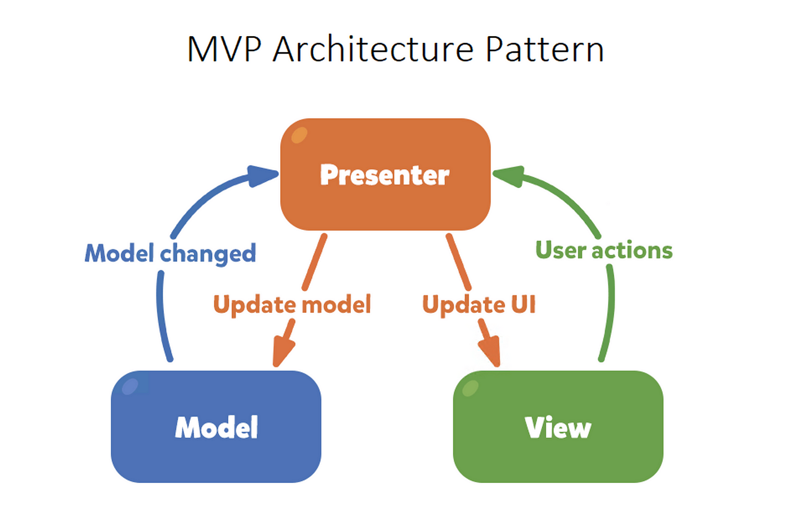
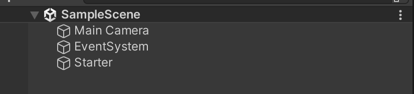
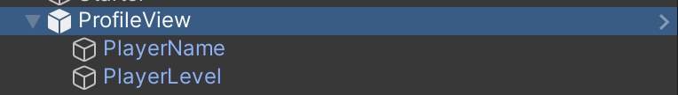
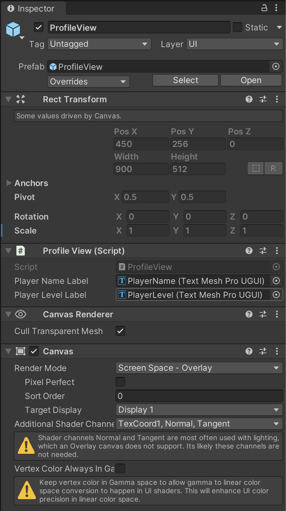
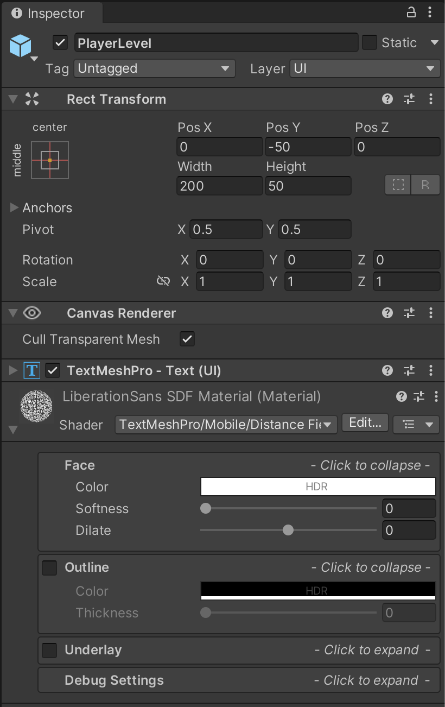
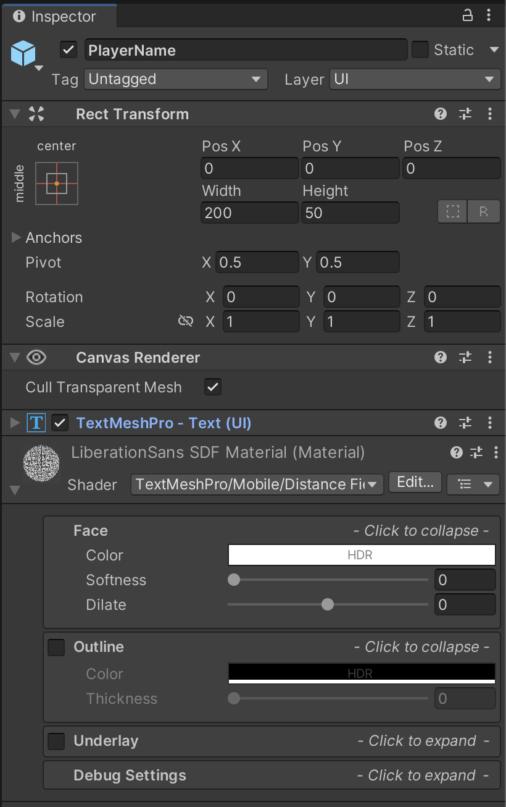
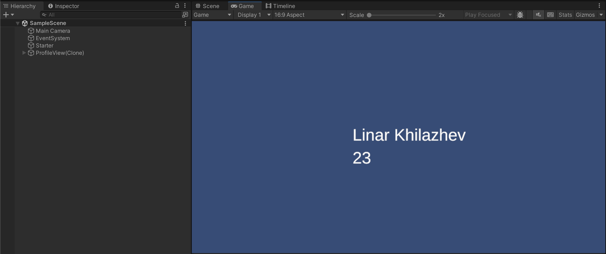

+++
date = '2024-10-27T15:32:11+07:00'
draft = false
title = 'Reducing UI Chaos Mvp Pattern'
+++

# Reducing UI Chaos: The MVP Pattern

Separating code to rule in interface development!



## General Information

**MVP** (Model, View, Presenter) is a UI design pattern from the MV* family (which also includes MVC and MVVM).

These approaches are characterized by a strict separation of logic, data, and visual representations, making it easy to scale and develop interfaces.

If you're involved in interface creation and programming logic, you've probably heard something about them.

## Motivation

An important question to ask when starting to use a particular design pattern is - **"Why? What will it bring?"**

I believe that design patterns solve an important long-term task - _reducing chaos and increasing the determinism of a project_.

When you start working on a new interface block, like a player profile (name, match stats, etc.), you'll know how to build it since you have a unified guideline/template for creating new interfaces (as will your team members).

As an example, we'll design a player profile interface, where we want to display the player's name and level.

_I decided to write this article to make it as clear and illustrative as possible (with code examples and diagrams). I’d be glad if someone gets interested and tries using it in their projects._

## Preparation

For simplicity and clarity, I constructed a class diagram to show the relationship of entities in our example.

For example, we see that **ProfilePresenter** acts as a link between **ProfileModel** and **ProfileView**.


Class diagram of the player profile.

Below, each part of the pattern will be described in more detail, task descriptions will be given, and code examples in C# will be attached.

## Model

The concept of the Model is about game data—storing, providing, and modifying it (getters, setters, and events).

In other words, the model is responsible for the game state at any given time and provides up-to-date information.

_For example, we can create a data model to store player profile information, which will include the player's name and level._

```csharp
using System;
namespace UI.Profile {
    public class ProfileModel {
        public event Action PlayerNameChanged;
        public event Action PlayerLevelChanged;

        private string _playerName;
        private int _playerLevel;

        public ProfileModel() {
            _playerName = "Linar Khilazhev";
            _playerLevel = 23;
        }

        public void SetPlayerName(string name) {
            _playerName = name;
            PlayerNameChanged?.Invoke();
        }

        public string GetPlayerName() => _playerName;

        public void SetPlayerLevel(int level) {
            _playerLevel = level;
            PlayerLevelChanged?.Invoke();
        }

        public int GetPlayerLevel() => _playerLevel;
    }
}
```

In our model, we store two values and provide GET/SET methods for each, as well as events for their changes.

_If desired, you can pass the updated value to each of the events:_

```csharp
public event Action<int> PlayerLevelChanged;
public void SetPlayerLevel(int level) {
    _playerLevel = level;
    PlayerLevelChanged?.Invoke(_playerLevel);
}
```

## View

The concept of View is about displaying information/data; it's about the internal content of the interface (links to text/graphic elements and input/output systems).

Besides links, the View can also have events for various user actions like button clicks, page scrolling, and value input in text fields.

```csharp
using TMPro;
using UnityEngine;

namespace UI.Profile {
    public interface IView {
        public void Enable();
        public void Disable();
    }

    public interface IProfileView : IView {
        public void SetPlayerName(string name);
        public void SetPlayerLevel(int level);
    }

    public class ProfileView : MonoBehaviour, IProfileView {
        public TextMeshProUGUI _playerNameLabel;
        public TextMeshProUGUI _playerLevelLabel;

        public void Enable() {
            gameObject.SetActive(true);
        }

        public void Disable() {
            gameObject.SetActive(false);
        }

        public void SetPlayerName(string name) {
            _playerNameLabel.SetText(name);
        }

        public void SetPlayerLevel(int level) {
            _playerLevelLabel.SetText(level.ToString());
        }
    }
}
```

_Interfaces and the class are combined in the example for clarity (in reality, they are separated)._

## Presenter

The Presenter acts as a link between data (**Model**) and display (**View**).

Its main task is to initialize initial values, subscribe to data changes, and update the interfaces.

```csharp
using Organization;
namespace UI.Profile {
    public class ProfilePresenter {
        private ProfileModel _profileModel;
        private IProfileView _profileView;

        public ProfilePresenter() {
            _profileModel = ProfileManager.GetProfileModel();
            _profileView = ProfileManager.GetProfileView();

            _profileModel.PlayerLevelChanged += UpdatePlayerLevel;
            _profileModel.PlayerNameChanged += UpdatePlayerName;

            _profileView.SetPlayerName(_profileModel.GetPlayerName());
            _profileView.SetPlayerLevel(_profileModel.GetPlayerLevel());
        }

        private void UpdatePlayerName() {
            _profileView.SetPlayerName(_profileModel.GetPlayerName());
        }

        private void UpdatePlayerLevel() {
            _profileView.SetPlayerLevel(_profileModel.GetPlayerLevel());
        }

        ~ProfilePresenter() {
            _profileModel.PlayerLevelChanged -= UpdatePlayerLevel;
            _profileModel.PlayerNameChanged -= UpdatePlayerName;
        }
    }
}
```

## Back to Unity

With the MVP structure and logic understood, how will it look in Unity?

It’s quite simple. We will create the needed elements lazily, i.e., the first time we access them.



Entities present in the scene.

Initially, there are no interfaces and logic on the scene; they are created through the **Starter.cs** class (attached to an object with the same name in the scene).

```csharp
using UnityEngine;

namespace Organization {
    public class Starter : MonoBehaviour {
        private void Awake() {
            CreateProfilePresenter();
        }

        private void CreateProfilePresenter() {
            var profilePresenter = ProfileManager.GetProfilePresenter();
        }
    }
}
```

This script refers to **ProfileManager.cs** and with a light touch creates ProfilePresenter (which creates ProfileModel and ProfileView inside its constructor).

Below is the code for creating/getting the necessary references.

```csharp
using UI.Profile;
using UnityEngine;

namespace Organization {
    public class ProfileManager {
        private static IProfileView _profileView;
        private static ProfileModel _profileModel;
        private static ProfilePresenter _profilePresenter;

        public static IProfileView GetProfileView() {
            if (_profileView == null) {
                var prefab = Resources.Load<ProfileView>(nameof(ProfileView));
                _profileView = Object.Instantiate<ProfileView>(prefab, Vector3.zero, Quaternion.identity);
            }
            return _profileView;
        }

        public static ProfileModel GetProfileModel() {
            if (_profileModel == null) {
                _profileModel = new ProfileModel();
            }
            return _profileModel;
        }

        public static ProfilePresenter GetProfilePresenter() {
            if (_profilePresenter == null) {
                _profilePresenter = new ProfilePresenter();
            }
            return _profilePresenter;
        }
    }
}
```

Now let's look at the **ProfileView**, which we retrieve from the Resources folder.



Prefab hierarchy.

| Components on the parent prefab ProfileView | Child element PlayerLevel with TextMeshPro component | PlayerName also has a TextMeshPro component and is a child |
|---------------------------------------------|------------------------------------------------------|------------------------------------------------------------|
|                                |                                       |                                             |

## Conclusion

When the game is launched, **ProfileView** is created on the scene, displaying data from **ProfileModel**.



I’ll also leave a link to the code [repository](https://github.com/linzer0/interface-pattern-mvp).

See you later.

